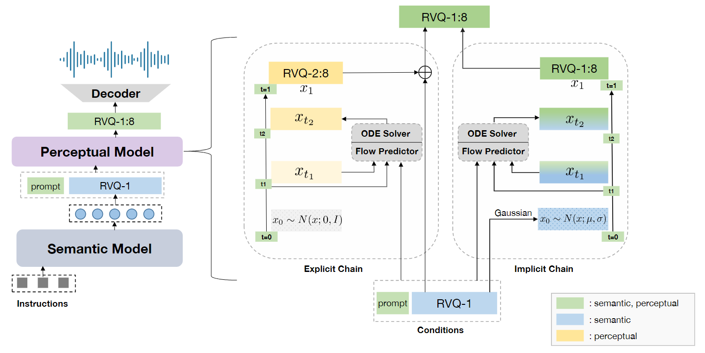

# SpeechGPT-Gen: Scaling Chain-of-Information Speech Generation (Preceptual Model)
[](https://arxiv.org/pdf/2401.13527.pdf) [](https://github.com/0nutation/SpeechGPT)  []()   [](https://0nutation.github.io/SpeechGPT-Gen.github.io/)

## Intorduction
This repository is the official implementation of SpeechGPT-gen preceptual model presented in [SpeechGPT-Gen: Scaling Chain-of-Information Speech Generation](https://arxiv.org/abs/2401.13527). SpeechGPT-Gen comprises an autoregressive model based on LLM for semantic information modeling and a non-autogressive model employing conditional flow matching for perceptual information modeling. SpeechGPT-Gen markedly excels in zero-shot text-to-speech, zero-shot voice conversion and speech-to-speech dialogue, underscoring CoIG's remarkable proficiency in capturing and modeling speech's semantic and preceptual dimentions. This repository contains implementations of ConditionalFlowMatcher, SoundStorm  and corresponding trainers for peceptual modeling. 
<br>
<p align="center">
     <br>
    Overview
</p>

## Release Schedule
- [2024/7] 🔥 We will realease conditional flow matching preceptual model checkpoints of SpeechGPT-Gen. 
- [2024/6] 🔥 We released code and SoundStorm checkpoint of SpeechGPT-Gen preceptual model. Checkout the [paper](https://arxiv.org/abs/2401.13527) and [demo](https://0nutation.github.io/SpeechGPT-Gen.github.io/).
- [2024/1] 🔥 We released paper and project of SpeechGPT-Gen[SpeechGPT-Gen](https://github.com/0nutation/SpeechGPT/tree/main/speechgpt-gen).

## Samples

Samples are provided on [our demo page](https://0nutation.github.io/SpeechTokenizer.github.io/).

## Installation
```shell
git clone https://github.com/ZhangXInFD/SpeechGPT-Gen-Preceptual-Model.git
cd SpeechGPT-Gen-Preceptual-Model
pip install -e .
```

## Usage
### Load Model
```python
from speechgpt_gen_preceptual import ConditionalFlowMatcher, SoundStorm
import yaml

# Conditional Flow Matching Model

# load from pretrained
ckpt_path = "[ckpt_path]"
cnf_model = ConditionalFlowMatcher.from_pretrained(ckpt_dir)
cnf_model.eval()

# Initializing from config
config_file = "[cfg_file]"
with open(config_file) as f:
    cfg = yaml.safe_load(config_file)
cnf_model = ConditionalFlowMatcher(cfg=cfg)


# SoundStorm Model

# load from pretrained
ckpt_path = "[CKPT_PATH]"
soundstorm = SoundStorm.from_pretrained(ckpt_dir)
soundstorm.eval()

# Initializing from config
config_file = "[cfg_file]"
with open(config_file) as f:
    cfg = yaml.safe_load(config_file)
soundstorm = SoundStorm(cfg=cfg)
```

### Infer
The following examples for voice conversion using SoundStorm, the flow matching model, and the hierarchical flow matching model (HuBERT -> DAC) are provided in: 
* [scripts/infer/soundstorm/voice_conversion.py](scripts/infer/soundstorm/voice_conversion.py)
* [scripts/infer/flowmatching/voice_conversion.py](scripts/infer/flowmatching/voice_conversion.py) 
* [scripts/infer/flowmatching/hier_voice_conversion.py](scripts/infer/flowmatching/hier_voice_conversion.py).

We explain the `generate` method arguments models in the following:
* ConditionalFlowMatcher
    * `semantic_emb`: Continuous semantic representations of source speech, namely RVQ-1 quantized of SpeechTokenizer.
    * `context`: RVQ-1:8 continuous representations extracted from target speech by SpeechTokenizer.
    * `context_semantic_emb`: Continuous semantic representations of target speech.
    * `steps`: ODE steps, default is 8.
    * `mask`: Sequence mask.
* HierarchicalConditionalFlowMatcher
    * `semantic_tokens`: Discrete semantic tokens of source speech, extracted by semantic model (like HuBERT).
    * `context`: Continuous acoustic representations extracted from target speech by acoustic model (like DAC).
    * `context_semantic_tokens`: Discrete semantic tokens of target speech.
    * `steps`: ODE steps, default is 8.
    * `mask`: Sequence mask.
* SoundStorm
    * `semantic_tokens`: Discrete semantic tokens of source speech. For  hierarchical models, they are extracted by the semantic model (HuBERT). For CoIG models, they are RVQ-1 discrete tokens from the SpeechTokenizer
    * `prompt_tokens`: Discrete acoustic tokens. For hierarchical models, they are RVQ-1:n discrete tokens from acoustic model (DAC/EnCodec). For CoIG models, they are RVQ-2:n discrete tokens from the SpeechTokenizer.
    * `num_full_sampling_levels`: Number of RVQ layers that need to employ MaskGIT strategies for sampling multiple steps, default is 1.
    * `steps`: Number of iteration steps for MaskGIT , default is 8.
    * `greedy`: Bool, whether use greedy search when generate tokens.
    * `generator_sample_temperature`: Gumbel-Softmax sampling tempreture.


### Train
Example training configuration files and scripts for the SoundStorm and Flow Matching models are provided in [config](config) and [scripts/train](scripts/train).We offer both hierarchical and CoIG examples for both models. You can adjust arguments in the configuration files to train your own model. 
```shell
cd SpeechGPT-Gen-Preceptual-Model

# Train
bash scripts/train/flowmatching/spt/train_example.sh
```
We explain some important arguments for these models below:
* `backbone_type`: [`transformer`, `uconformer`, `conformer`, `uformer`] are available.

## Citation
If you use this code or result in your paper, please cite our works as:
```Tex
@misc{zhang2023speechtokenizer,
      title={SpeechTokenizer: Unified Speech Tokenizer for Speech Language Models}, 
      author={Xin Zhang and Dong Zhang and Shimin Li and Yaqian Zhou and Xipeng Qiu},
      year={2023},
      eprint={2308.16692},
      archivePrefix={arXiv},
      primaryClass={cs.CL}
}

@article{zhang2024speechgpt,
  title={SpeechGPT-Gen: Scaling Chain-of-Information Speech Generation},
  author={Zhang, Dong and Zhang, Xin and Zhan, Jun and Li, Shimin and Zhou, Yaqian and Qiu, Xipeng},
  journal={arXiv preprint arXiv:2401.13527},
  year={2024}
}
```

## License
The code in this repository is released under the MIT license as found in the
[LICENSE](LICENSE) file.
